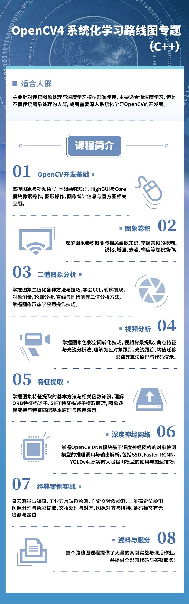

# OpenCV课程资料

#### 内容介绍
此仓库主要是B站课程的图像资料与源码下载！此外还包括我在51CTO，网易云课堂，CSDN学院上课程的图像与视频数据资料！
同时还有大量的C++与Python的OpenCV算法演示代码，极具参考价值！

#### B站视频学习
我录制了30课时的OPenCV4 C++版本的免费视频，在B站
提供给大家免费学习，需要直接点击下面地址即可
OpenCV4.x  C++快速入门视频教程
https://www.bilibili.com/video/BV1i54y1m7tw

更多视频教程搜索B站【OpenCV学堂】

### OpenCV4 系统化学习路线图专题（C++）
- <b>OpenCV开发基础</b> 
掌握图象与视频读写，基础函数知识，HighGUI与Core模块像素操作，图形操作，图象统计信息与直方图相关应用。
- <b>图象卷积</b> 
理解图象卷积概念与相关函数知识，掌握常见的模糊、锐化、增强、去噪、梯度等卷积操作
- <b>二值图象分析</b> 
掌握图象二值化各种方法与技巧，学会CCL，轮廓发现，对象测量，轮廓分析，直线与圆检测等二值分析方法，掌握图象形态学应用操作技巧
- <b>视频分析</b> 
掌握图象色彩空间转化技巧，视频背景提取、角点特征与光流分析法、理解颜色对象跟踪、光流跟踪、均值迁移跟踪等算法原理与代码演示
- <b>特征提取</b> 
掌握图象特征提取的基本方法与相关函数知识，理解ORB特征描述子、SIFT特征描述子提取原理，图象透视变换与特征匹配基本原理与应用演示
- <b>深度神经网络</b> 
掌握OpenCV DNN模块基于深度神经网络的对象检测模型的推理调用与输出解析，包括SSD、Faster-RCNN、YOLOv4、高实时人脸检测模型的使用与加速技巧。
- <b>经典案例实战</b> 
星云测量与编码、工业刀片缺陷检测、自定义对象检测、二维码定位检测
图像分割与色彩提取、文档处理与对齐、图象对齐与拼接、条码标签有无检测与定位
- <b>资料与服务</b> 
整个路线图课程提供了大量的案例实战与课后作业，并提供全部原代码与答疑服务！

- <b>适合人群：</b> 
主要针对传统图象处理与深度学习模型部署使用，主要适合懂深度学习，但是不懂传统图象处理的人群，或者需要深入系统化学习OpenCV的开发者。

- <b>扫码查看课程目录与学习！</b> 

## 联系方式
QQ:57558865 注明：opencv即可

邮件:57558865@qq.com

微信：bfnh2qxx 注明 合作

<b>非技术合作请勿加微信</b>

微博 ： http://weibo.com/u/3181256271

CSDN博客地址： http://blog.csdn.net/jia20003

腾讯课堂主页：https://opencvxuetang.ke.qq.com/

### OpenCV学堂 微信公众号

